<div align="center">

# 🚢 Freight Forwarding & Customs Clearing ERP

**An order-centric ERP for freight forwarding and customs clearing — from a customer's
first enquiry in Dhaka to their goods landing in the warehouse, priced by the cubic
metre with every taka of duty, cost and profit tracked along the way.**

[](https://php.net)
[](https://laravel.com)
[](https://pestphp.com)
[](#-testing)
[](https://laravel.com/docs/pint)

</div>

---

## What this is

This is **not** a shop and it owns no stock. It models a real **freight-forwarding and
customs-clearing business**: a customer's goods are consolidated into a container,
shipped, cleared at port, received into a Bangladesh warehouse and delivered — and you
are paid **by the cubic metre** for moving them.

There is no product catalogue. An item is a **tariff line**: type an HS code and the
customs description and its six duty rates fill themselves in from the imported
Bangladesh Customs tariff.

The **Order is the hub**. Everything — items, freight, duty, LC bank charges, container
costs, payments, tracking history — hangs off the order, so the profit on any shipment
is always one page away.

```mermaid
flowchart LR
    A["📝 Quotation<br/>request"] --> B["💬 Quote<br/>sent & accepted"]
    B --> C["📦 Order<br/>created"]
    C --> D["🏭 Sourcing"]
    D --> E["🇨🇳 China<br/>warehouse"]
    E --> F["🚢 Shipped<br/>container + LC"]
    F --> G["⚓ At port"]
    G --> H["🏬 BD warehouse<br/>received into stock"]
    H --> I["✅ Delivered"]

    style A fill:#eef2ff,stroke:#6366f1,color:#1e1b4b
    style C fill:#eef2ff,stroke:#6366f1,color:#1e1b4b
    style H fill:#ecfdf5,stroke:#10b981,color:#064e3b
    style I fill:#ecfdf5,stroke:#10b981,color:#064e3b
```



Every status change is written to a tracking timeline, and reaching **At BD Warehouse**
automatically receives the order's items into warehouse inventory as stock lots.

Each order carries a random tracking token, and its public link is built from that
rather than from the order number — order numbers run in sequence, so a link built on
one could be edited into somebody else's shipment. Copy the link from the order page
and send it to the customer.

**Carton QR labels.** The QR sits in the order's **Tracking Timeline** card, and on the
customer's tracking page — either of you can print it, so nothing has to be emailed
across. *Print carton labels* runs off one label per carton: the QR with the shipping
mark under it. The customer sticks them on the packages before handover.

Scanning a label opens the tracking page — and that page shows two different things
depending on who is scanning:

| Who scans | What they get |
|---|---|
| Anyone — the customer, a courier, a stranger | Status and timeline, nothing else |
| Signed-in staff with `orders.scan` | The same, plus a panel to count cartons through the next stage |

The panel shows how many cartons are expected and how many have been counted at each
point. **Recording is done in the scanner** (*Orders → Scan Cartons*, or the warehouse
menu): the camera reads the carton's QR, and only then can a count be entered — received
at the China warehouse, loaded into a container (picked from those still open), arrived
at port, received into a BD warehouse. Counts add up, so a consignment arriving in two
lorries is no trouble. Loading cartons into a container also puts the order in that
container and re-splits its costs.

Reading a carton hands out a one-shot key that the recording is checked against, so a
scan can't be typed in from a desk and one read of a code can't be counted twice.

> [!IMPORTANT]
> **The scanner needs HTTPS.** Browsers only grant camera access over `https` (or on
> `localhost`), and there is deliberately no way to record a count without the camera.
> Over plain `http` the page says so plainly instead of failing quietly. The scanner
> library is served from `public/backend/assets/libs/`, so it works without internet.

---

## ✨ Four surfaces, one system

| Surface | Route | Who | What they get |
|---|---|---|---|
| **Admin panel** | `/dashboard` | Admin, Staff, Accountant | The full pipeline — customers, HS codes, quotations, orders, costs, LC, containers, finance, reports |
| **Customer portal** | `/portal` | Customers | Submit requests, accept or reject quotes, follow orders, view payments and dues |
| **Warehouse portal** | `/warehouse` | Warehouse managers | Inventory, incoming orders, expenses, staff and payroll — scoped to their own warehouse |
| **Public tracking** | `/track/{token}` | Anyone with the link | Status and timeline for one shipment — no financials, no login |

Admins can step into any warehouse's portal via **Warehouse → Warehouse List → Manage**,
without needing a separate warehouse login.

---

## 🧩 Modules

<table>
<tr><td width="50%" valign="top">

**Tariff & quoting**
- Customers and customer groups
- HS code database imported from the customs tariff book
- Type-ahead HS lookup fills description + CD/SD/VAT/AIT/RD/AT
- Quotations priced per CBM, with duty projected per line
- Excel packing-list import (PhpSpreadsheet)
- Total cost vs. customer price, side by side
- One-click convert quotation → order

</td><td width="50%" valign="top">

**Logistics**
- Orders with a 9-stage status pipeline
- Tracking timeline with who changed what
- Letters of Credit — PI, bank charges, USD rates
- Containers with LCL/FCL, POL/POD, ETD/ETA
- Orders split across containers
- Generated packing and loading lists
- Printable, brandable invoices

</td></tr>
<tr><td valign="top">

**Finance**
- Payment accounts with a full transaction ledger
- Fund transfers, deposits, no-overdraft guard
- Three cost buckets feeding order profit
- Multiple payments per order
- Profit & Loss, Receivables, Balance Sheet, Cash Flow

</td><td valign="top">

**Warehouse operations**
- Order-driven inventory lots and movements
- Expenses with multi-payment settlement
- Staff records, documents, salaries
- Month-by-month payroll board
- Per-staff salary summary by year

</td></tr>
</table>

---

## 💰 How the money model works

This is the heart of the system. Costs live in the place they belong, and all of them
roll up into one number.

```
Order revenue                        (sell rate per CBM × the shipment's CBM)
  − freight                          (cost rate per CBM × the shipment's CBM)
  − duty & taxes                     (the customs cascade on each line's declared value)
  − order costs                      (clearing, local transport, service…)
  − LC cost                          (bank charges + LC charge lines)
  − allocated container cost         (shared cost split by CBM, weight, cartons or equally)
  ─────────────────────────────────
  = Gross profit per order

Gross profit (all orders)
  − warehouse expenses               (rent, utilities, maintenance…)
  − staff salaries
  ─────────────────────────────────
  = Net profit                       (Reports → Profit & Loss)
```

A container's cost is shared across every order inside it using the basis you pick per
container, so a consolidated shipment attributes its freight fairly. Whenever container
membership or costs change, every affected order's profit is recomputed automatically.

Any cost or payment can be **paid from a payment account**. When it is, the system debits
that account, writes a polymorphic ledger transaction, and updates the running balance —
and deleting the record reverses all of it.

---

## 🔐 Roles & permissions

Permissions are database-driven and editable in the admin roles matrix. `Gate::before`
resolves every ability against the user's role, with Admin bypassing all checks.

| Role | Scope |
|---|---|
| **Admin** | Everything, including account balances and settings |
| **Staff / Agent** | Customers, HS codes, quotations, orders, LC, containers — no finance |
| **Accountant** | Costs, payment accounts, payments, reports, expense categories |
| **Customer** | Customer portal only, scoped to their own contact record |
| **Warehouse** | Warehouse portal only, scoped to their assigned warehouse |

> **Account balances are admin-only.** Other roles can pay from an account without ever
> seeing what it holds — every selector renders through the `<x-account-options>`
> component, which is gated on `accounts.view-balance`.

---

## 🛠 Tech stack

| Layer | Choice |
|---|---|
| Backend | PHP 8.2, Laravel 12 (streamlined structure — no `Http/Kernel.php`) |
| Database | MySQL 8 |
| Views | Blade + a Bootstrap 5 admin theme; Vite, Tailwind and Alpine for the Breeze auth scaffolding |
| Tables | A custom, dependency-free `<x-data-table>` — search, sort, filters, column toggles, CSV/print export, no jQuery |
| Spreadsheets | PhpSpreadsheet (packing-list import, customs tariff import) |
| Images | Intervention Image |
| Tests | Pest 3 on SQLite in-memory |
| Style | Laravel Pint |

---

## 🚀 Getting started

**Requirements:** PHP 8.2+ with the `zip` extension, Composer, MySQL, Node 18+.

```bash
git clone https://github.com/smhasibul0/Project1.git
cd Project1

composer install
cp .env.example .env
php artisan key:generate
```

Point `.env` at your database, then create it and load the starter data:

```bash
# .env
DB_DATABASE=export
DB_USERNAME=root
DB_PASSWORD=

php artisan migrate --seed
npm install && npm run build
php artisan serve
```

Seeding creates the roles and permission catalog, account types, customer groups,
a Main Warehouse, transportation modes, packing types, cost categories, expense
categories, company invoice settings, and one **admin** user:

```
email:    test@example.com     (or username: testuser)
password: password
```

The login field accepts an email **or** a username. Change this password before putting
anything real in the database.

**Load the customs tariff.** The HS code database starts empty. Go to **HS Codes →
Import from Excel** and upload the published Bangladesh Customs tariff workbook — around
7,400 lines load in about fifteen seconds, each with its full customs description and its
rate of customs duty. The book carries CD only; SD, VAT, AIT, RD and AT arrive from a
second upload of a rates sheet (HS code + those columns), or are keyed in per code.

**Creating the other logins:**
- **Customer** — Customers → Customer List → row actions → *Create Login*
- **Warehouse** — Users → Add User → role `Warehouse`, then pick the warehouse

---

## 🧪 Testing

```bash
composer test                      # full suite (261 tests)
php artisan test --compact --filter=WarehousePortalTest
```

> [!WARNING]
> **Always clear the config cache before running tests.** If `bootstrap/cache/config.php`
> exists, `phpunit.xml`'s SQLite settings are ignored and `RefreshDatabase` will run
> `migrate:fresh` against your **live MySQL database**, dropping all development data.
> The `composer test` script clears it for you; calling `php artisan test` directly does not.

Before finalising any PHP change:

```bash
vendor/bin/pint --dirty
```

---

## 📁 Project structure

```
app/
├── Http/
│   ├── Controllers/
│   │   ├── Backend/        Admin panel (orders, LC, containers, reports, finance…)
│   │   └── Warehouse/      Warehouse portal (inventory, expenses, staff, payroll)
│   └── Middleware/         EnsureAdminAccess · EnsureCustomerAccess · EnsureWarehouseAccess
├── Models/                 Order is the hub; costs, payments and stock hang off it
├── Providers/              Gate definitions (orders.view, accounts.view-balance)
└── Support/                CurrentWarehouse · PackingListParser · HsCodeSheetImporter
                            DutyCalculator · NumberToWords

resources/views/
├── admin/backend/          Admin screens
├── portal/                 Customer portal
├── warehouse/              Warehouse portal
└── components/             x-data-table · x-account-options · x-customer-select · x-hs-search

tests/Feature/              Pest feature tests, one file per module
```

---

## 🤝 Conventions

- Follow the structure and naming of neighbouring files — check a sibling before inventing a pattern.
- Every change ships with a test; run the affected suite before committing.
- Action columns come **first** in every table, as a dropdown.
- Never render `$account->balance` directly — always use `<x-account-options>`.
- Money is BDT (৳) throughout; multi-currency is not yet implemented.
- Run `vendor/bin/pint --dirty` before finalising.

---

<div align="center">
<sub>Built with Laravel · Company details, logo, invoice colours and terms are configurable under <b>Settings → Company</b></sub>
</div>
